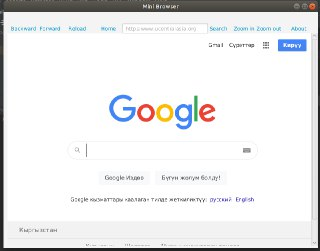
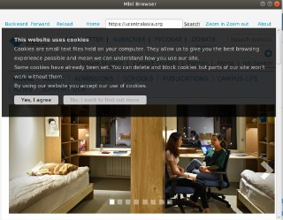
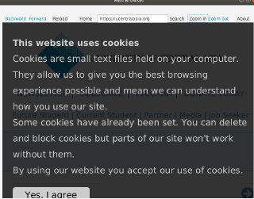
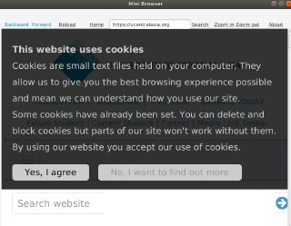
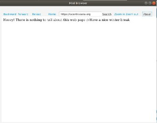

# cool-web-browser
Author: Burulsun Taalaibekova

If the usual VM set up doesn't work(/javafx-sdk-11.0.2/lib --add-modules javafx.controls,javafx.fxml), please try to put this link instead

--module-path /home/uca/javafx-sdk-11.0.2/lib  --add-modules=javafx.swing,javafx.graphics,javafx.fxml,javafx.media,javafx.web --add-reads javafx.graphics=ALL-UNNAMED --add-opens javafx.controls/com.sun.javafx.charts=ALL-UNNAMED --add-opens javafx.graphics/com.sun.javafx.iio=ALL-UNNAMED --add-opens javafx.graphics/com.sun.javafx.iio.common=ALL-UNNAMED --add-opens javafx.graphics/com.sun.javafx.css=ALL-UNNAMED --add-opens javafx.base/com.sun.javafx.runtime=ALL-UNNAMED

Initial Look:

zoomIn.jpeg

Search Button, you need to enter full link:

Zoom in will increase the size of your page to 10%:

Zoom out will decrease the size of your page to 10%:

About button will give broader information, in my case it gives a message :)

